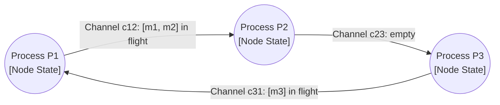
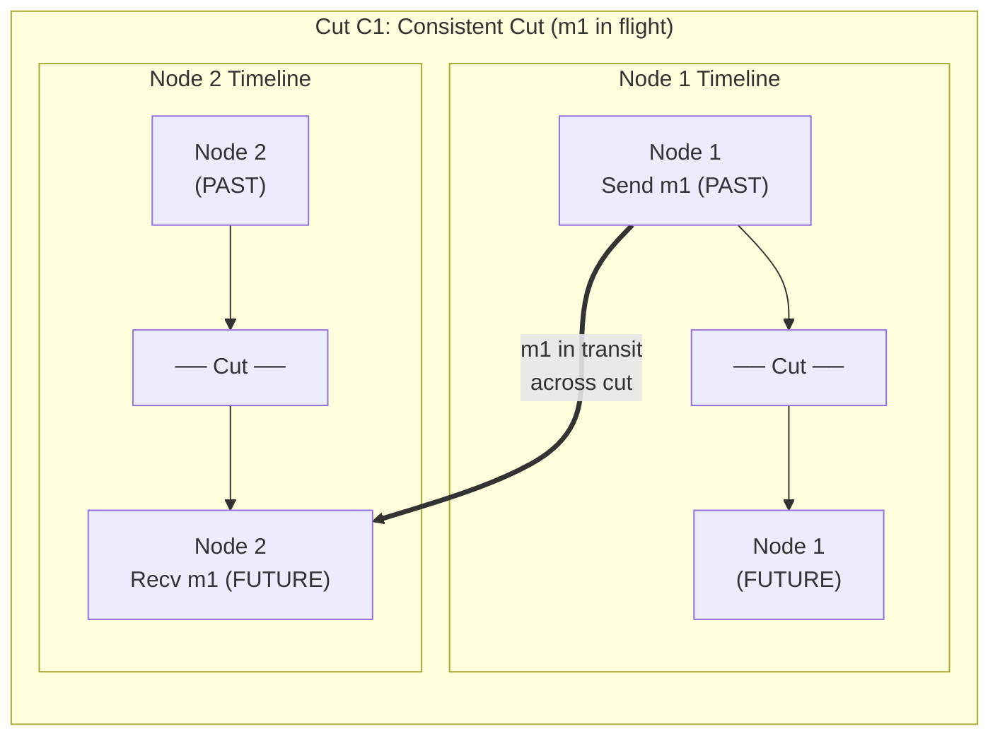
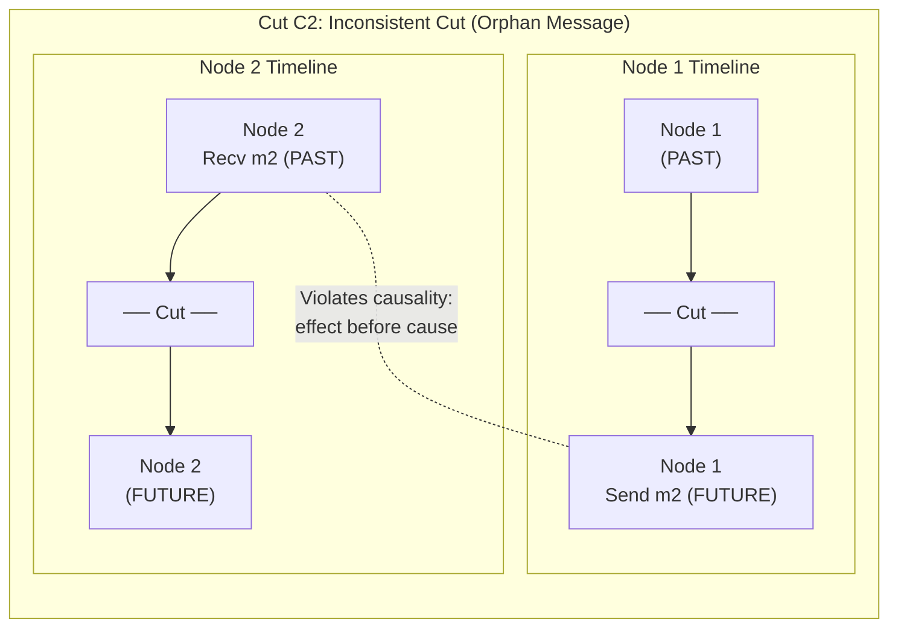
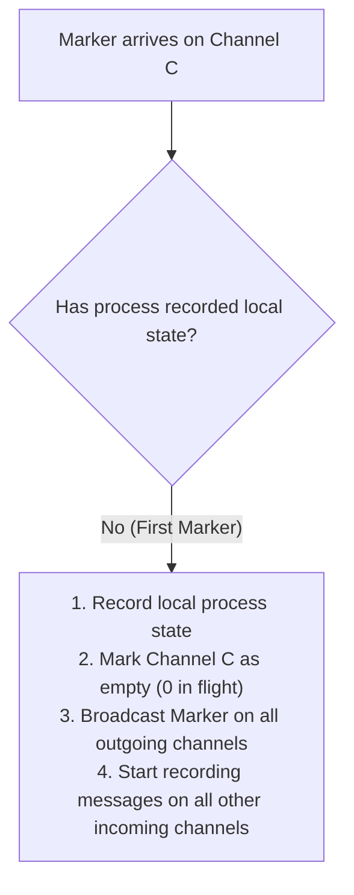
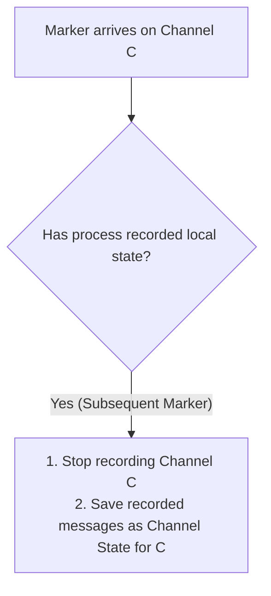
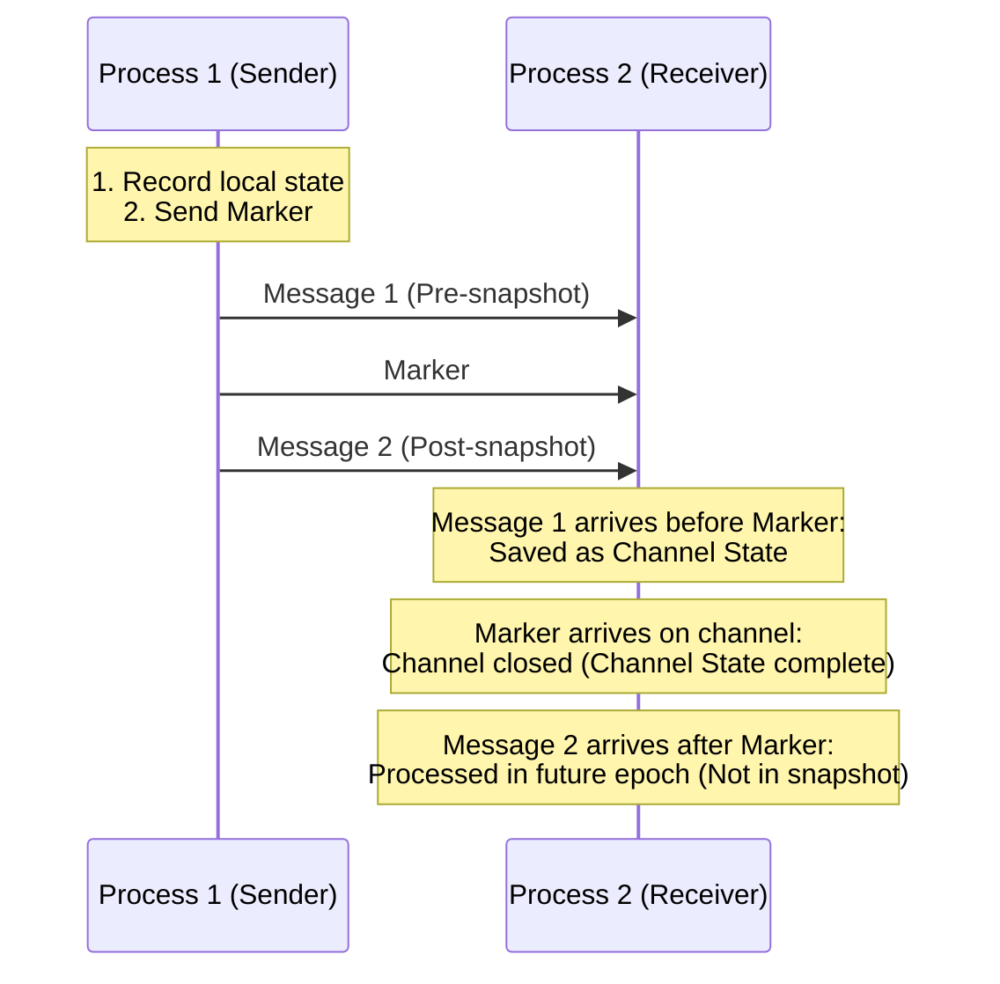
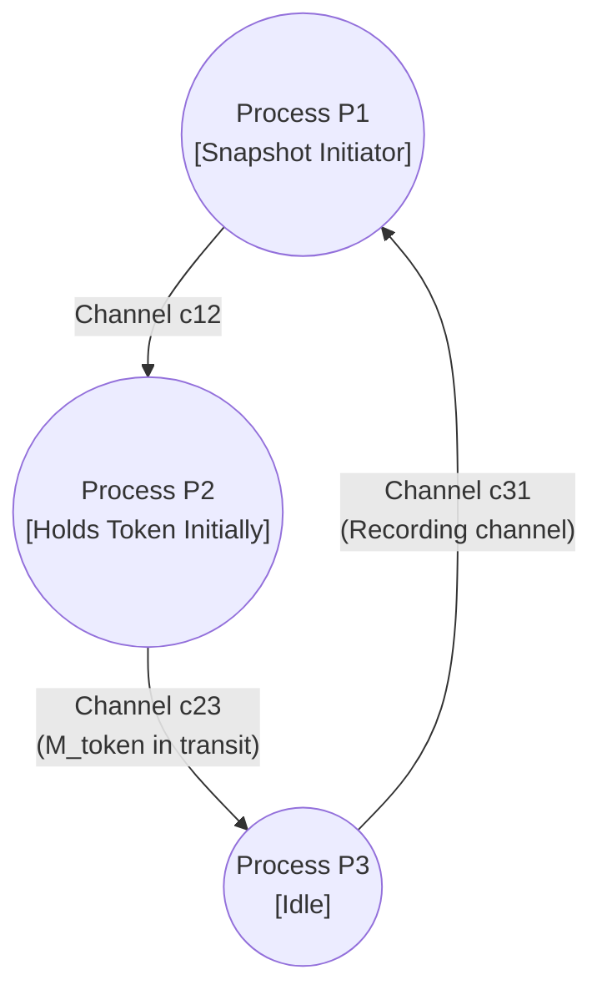

Capturing the global state of a distributed system requires recording a consistent view of every node and network channel without relying on a shared physical clock. As explored in [Why Distributed Systems Can't Trust the Clock](/blog/distributed-system-classics/01-time-clocks-ordering), physical clocks drift and variable network delays make it impossible for independent nodes to agree on a universal instant in physical time<sup><a href="#ref-1">[1]</a></sup>. In a single-node system, state persistence is straightforward: pause execution briefly, copy memory or trigger a copy-on-write fork, and resume. In a distributed architecture spanning hundreds of nodes, physical time cannot establish a simultaneous cut across the cluster.

A concrete example makes the stakes clear.

Consider a distributed database maintaining two bank accounts across separate servers: Account A on Node 1 (starting balance \$100) and Account B on Node 2 (starting balance \$50). The true total balance across the system is \$150.

Suppose an auditor triggers a snapshot of the global balance while Account A simultaneously transfers \$30 to Account B. Because message delivery across network channels is subject to variable latency and local scheduling queues, Node 1 and Node 2 record their local balances at different moments:

- **The orphan message (money created):** Node 2 receives the transfer and updates Account B's balance to \$80 before taking its snapshot. Meanwhile, Node 1 delays its snapshot and records its balance before processing the outgoing transfer deduction (Account A still records \$100). The resulting global snapshot records \$100 + \$80 = \$180. Thirty dollars were created out of thin air: Node 2 recorded the _effect_ of a message that Node 1 has not yet _sent_ in the snapshot timeline. This is what's called an **orphan message** — a received message whose send event doesn't exist in the snapshot.
- **The missing message (money vanished):** Node 1 records its snapshot after deducting \$30 (leaving \$70), but the \$30 transfer message is in flight across the network when Node 2 records Account B (still \$50). If the snapshot only records node memory and ignores the network wire, the recorded total is \$70 + \$50 = \$120. Thirty dollars vanished.

The intuitive mental baseline for avoiding this is a coordinated **"Stop-the-World"** freeze: pause all incoming requests, wait for in-flight network messages to settle, record the memory of every node, and resume execution. In an asynchronous distributed network, freezing the world is neither practical nor straightforward. Halting nodes causes cascading timeouts and buffer overflows. Furthermore, without synchronized clocks or distributed consensus, coordinating the freeze across independent nodes requires a complex distributed agreement protocol of its own.

Taking a global snapshot without stopping the world requires capturing both process memory and in-flight network messages while guaranteeing that no causality violations occur.

In 1985, K. Mani Chandy and Leslie Lamport showed that a distributed system can capture a consistent global state without pausing execution or relying on synchronized physical clocks<sup><a href="#ref-2">[2]</a></sup>.

---

## The Anatomy of Distributed State

Before capturing a global state, we must define its components.

In a single server, state consists of memory and local disk. In a distributed network, data also travels across network wires. Recording only the local memory of each node ignores messages in flight.

The global state of a distributed system consists of two parts:

1. **Node state:** The local memory and internal variables of every individual process.
2. **Channel state:** The exact sequence of messages currently in transit on the network channels connecting those processes.

To produce a consistent snapshot, an algorithm must capture both.



---

## Consistent Cuts and Causal Ordering

A global snapshot represents a **cut** across the execution history of a distributed system. A cut partitions all system events into two sets: PAST (events included in the snapshot) and FUTURE (events occurring after the snapshot).

A cut is a **consistent cut** if it is causally closed under the happens-before relation: for every event $e$ in the PAST, if event $c$ caused $e$ ($c \rightarrow e$), then $c$ must also be in the PAST.

### Cut $C_1$: Consistent Cut (In-Flight Message)

In Cut $C_1$, message $m_1$ was sent before Node 1's cut, but received after Node 2's cut. The send is recorded in the PAST, while the receipt belongs to the FUTURE.



This cut is valid: $m_1$ was in transit across the network at the cut boundary. It must be captured as **channel state**.

### Cut $C_2$: Inconsistent Cut (Orphan Message)

In Cut $C_2$, message $m_2$ is received before Node 2's cut, but sent after Node 1's cut.



Node 2 records receiving a message that Node 1 has not yet sent in the snapshot timeline — an orphan message. A valid snapshot algorithm must eliminate orphan messages while capturing in-flight messages.

---

## The Chandy-Lamport Algorithm (1985)

The Chandy-Lamport algorithm provides a decentralized method for taking a consistent snapshot of an active system without pausing ongoing processing.

### System Model and Assumptions

Chandy and Lamport framed their solution around four system assumptions:

- **No process crashes:** Nodes do not fail during snapshot collection.
- **Reliable channels:** Messages are delivered without loss or duplication.
- **Strict FIFO channels:** Messages on any directed channel arrive in the exact order they were sent.
- **Strongly connected graph:** A directed path exists between any two processes (the network graph does not require a direct edge between every pair, but messages must be routable between all nodes).

### Original Purpose: Stable Property Detection

The 1985 paper was motivated by the problem of detecting **stable properties** in distributed computations. A property is stable if once it becomes true, it remains true in all subsequent system states. Examples include:

- **Distributed deadlock:** A cycle of processes waiting on locks held by each other.
- **Termination detection:** Determining when all nodes have become idle and no messages remain in flight.
- **Garbage collection:** Identifying distributed objects that are no longer referenced by any node or message.
- **Checkpointing:** Creating a valid state to which a cluster can roll back in the event of failure.

Because stable properties never spontaneously become false, detecting them in a snapshot guarantees they hold in the live system.

### The Marker Rules

Chandy and Lamport solved distributed coordination by introducing a control message called a **marker** that flows along regular communication channels alongside application data.

Any process can initiate a snapshot. The protocol consists of two rules:

```
[Initiator Rule for Process P]
1. Record local process state.
2. Send Marker on all outgoing channels.
3. Start recording incoming messages on all incoming channels.

[Receiving Rule for Process Q on Channel C]
IF Q has NOT yet recorded its local state:
    Record local process state.
    Mark channel C as empty (zero in-flight messages).
    Send Marker on all outgoing channels.
    Start recording incoming messages on all other incoming channels.
ELSE:
    Stop recording channel C.
    The recorded messages on C form the Channel State for C.
```

### Case 1: First Marker Arrival

When process $Q$ receives a marker on channel $C$ for the first time, it has not yet joined the snapshot. The arrival of the marker triggers $Q$'s local snapshot:



Because channels are strictly FIFO, any message sent on channel $C$ before the marker has already arrived and was included in $Q$'s state before the marker. Therefore, channel $C$ holds zero in-flight messages at the moment of the snapshot cut.

### Case 2: Subsequent Marker Arrival

When process $Q$ receives a marker on channel $C$ after having already recorded its local state, channel $C$ was actively recording incoming traffic. The arrival of the marker closes that channel's recording window:



The sequence of messages logged on channel $C$ between the moment $Q$ took its local snapshot and the moment the marker arrived constitutes the channel state for channel $C$.

Once a process has received a marker on every incoming channel, its portion of the global snapshot is complete. In the original paper, nodes send their local state and recorded channel logs to the initiator to assemble the global view, or preserve them locally for distributed property testing.

### The Mental Model: The Wave Front

Because channels are strictly FIFO, markers act as partition walls moving through the network. The following sequence diagram shows how a marker separates pre-snapshot and post-snapshot messages on a single channel:



The marker wave slices the distributed execution history into pre-marker and post-marker epochs, capturing in-flight messages on each channel while ensuring that no orphan messages cross the boundary.

---

## Step-by-Step Trace: A Three-Node Token Ring

To see the algorithm in action, consider a strongly connected ring of three processes: $P_1 \rightarrow P_2 \rightarrow P_3 \rightarrow P_1$.

A single token message $M_{\text{token}}$ circulates clockwise around the ring.



1. **Initiation at $P_1$:**
   $P_1$ decides to take a snapshot. $P_1$ holds no token.
    - $P_1$ records its local state: `State(P1) = { hasToken: false }`.
    - $P_1$ sends a `Marker` to $P_2$.
    - $P_1$ begins recording incoming channel $P_3 \rightarrow P_1$.

2. **In-Flight Application Message:**
   Meanwhile, $P_2$ holds the token and sends $M_{\text{token}}$ to $P_3$ _before_ $P_1$'s marker arrives at $P_2$.

3. **$P_2$ Receives First Marker from $P_1$:**
   $P_2$ receives the `Marker` on channel $P_1 \rightarrow P_2$.
    - $P_2$ has not yet recorded its state, so this is Case 1.
    - $P_2$ records its state: `State(P2) = { hasToken: false }` (token was already sent).
    - Channel $P_1 \rightarrow P_2$ is recorded as empty.
    - $P_2$ forwards `Marker` to $P_3$.
    - $P_2$ has only one incoming channel ($P_1 \rightarrow P_2$), which was already closed by the marker, so $P_2$'s snapshot is complete.

4. **$P_3$ Receives $M_{\text{token}}$ and then First Marker from $P_2$:**
   $M_{\text{token}}$ arrives at $P_3$ ahead of the `Marker` (due to FIFO ordering from $P_2$).
    - $P_3$ updates its internal state to hold the token.
    - Next, the `Marker` arrives from $P_2$.
    - $P_3$ has not recorded state yet (Case 1).
    - $P_3$ records its state: `State(P3) = { hasToken: true }`.
    - Channel $P_2 \rightarrow P_3$ is marked empty.
    - $P_3$ forwards `Marker` to $P_1$.

5. **$P_1$ Receives Subsequent Marker from $P_3$:**
   The `Marker` from $P_3$ arrives at $P_1$ on channel $P_3 \rightarrow P_1$.
    - $P_1$ has already recorded its state, so this is Case 2.
    - $P_1$ stops recording channel $P_3 \rightarrow P_1$.
    - No application messages arrived on $P_3 \rightarrow P_1$ during the recording window, so channel state is empty: `Channel(P3 -> P1) = []`.

6. **Termination:**
   All processes have received markers on all incoming channels. The assembled global snapshot:
    - Node states: `P1: false`, `P2: false`, `P3: true`.
    - Channel states: all empty.
    - Total tokens in snapshot: exactly 1.

The global state correctly preserves the invariant that exactly one token exists in the ring, with zero coordination stalls during application message passing.

---

## What the Snapshot Actually Represents

The global state captured by Chandy-Lamport may not correspond to an instantaneous physical point in time. Different nodes record their states at different physical wall-clock moments.

However, the algorithm guarantees that the captured state is causally consistent and reachable: it is a state the system could have passed through during its actual execution had message delivery latencies varied slightly. Think of it this way: if you replayed the system's execution and randomly delayed some messages by a few milliseconds, there exists a run where the entire system passed through the exact state recorded in the snapshot. For distributed debugging, rollback recovery, and invariant checking (such as deadlock or termination detection), causal consistency is sufficient.

---

## Limitations of the 1985 Design

Despite its theoretical clarity, the vanilla Chandy-Lamport algorithm has practical constraints that limited direct production deployment:

1. **Failure intolerance:** The algorithm assumes no node crashes. If a single node crashes during marker propagation, downstream nodes wait indefinitely for markers on incoming channels, causing the snapshot protocol to deadlock.
2. **Lossless channel requirement:** If a marker is lost due to network packet drop, the snapshot never terminates.
3. **The channel logging tax:** In high-throughput systems processing millions of records per second, logging all messages that arrive between the local snapshot and the marker arrival consumes substantial memory buffers and requires high-bandwidth disk I/O.

---

## The Legacy: How Chandy-Lamport Inspired Modern Stream Processing

For decades, the Chandy-Lamport algorithm was studied primarily in academic literature and applied to distributed debugging. It was rarely deployed in high-throughput data processing because managing and persisting channel state was too expensive.

The rise of real-time stream processing engines in the 2010s revived the problem. Engines like Apache Flink needed to snapshot state continuously across hundreds of distributed workers without stalling low-latency data streams.

Flink’s creators realized that stream processing pipelines possess an architectural constraint that general distributed systems do not: execution graphs are **Directed Acyclic Graphs (DAGs)**.

By exploiting DAG topologies, Flink adapted Chandy-Lamport’s marker wave into **Asynchronous Barrier Snapshotting (ABS)**<sup><a href="#ref-3">[3]</a></sup>:

1. **Markers become barriers:** Control markers are injected directly into data streams at source operators and flow with data records through the DAG.
2. **Barrier alignment eliminates channel state:** When an operator has multiple inputs, it temporarily buffers records from channels whose barriers arrive early, waiting until barriers arrive on all inputs. At that point, the operator takes its snapshot. Because all barriers are aligned, zero in-flight channel state needs to be stored.
3. **Asynchronous state offloading:** State metadata is frozen synchronously in milliseconds (e.g., RocksDB memtable freeze), while the actual data payload uploads to durable storage (such as S3) asynchronously in the background.

When severe backpressure causes barrier alignment to stall, modern Flink engines even return full circle to Chandy-Lamport's original philosophy: **unaligned checkpoints** let barriers overtake queued data and persist channel buffers into the snapshot.

A future post in this series may explore Flink’s Asynchronous Barrier Snapshotting, barrier alignment mechanics, and unaligned checkpoints in detail.

---

## Summary

The challenge of distributed snapshots stems from the absence of a global clock. Chandy and Lamport demonstrated that causality, enforced via FIFO marker propagation, provides a valid substitute for simultaneity.

By slicing execution history into pre-marker and post-marker epochs, the algorithm captures both local process memory and in-flight transit messages without introducing a global pause. While the original formulation assumed lossless networks and crash-free nodes, its core insight—using control tokens to delineate consistent cuts across asynchronous channels—remains the foundation of modern distributed state management.

---

## References

<span id="ref-1">[1]</span> Lamport, L. "Time, Clocks, and the Ordering of Events in a Distributed System." Communications of the ACM, 21(7), pp. 558-565, 1978. <https://lamport.azurewebsites.net/pubs/time-clocks.pdf>

<span id="ref-2">[2]</span> Chandy, K. M., & Lamport, L. "Distributed Snapshots: Determining Global States of Distributed Systems." ACM Transactions on Computer Systems, 3(1), pp. 63–75, 1985. <https://lamport.azurewebsites.net/pubs/chandy.pdf>

<span id="ref-3">[3]</span> Carbone, P., Győrösi, G., Stühmer, R., Markl, V., & Haridi, S. "Lightweight Asynchronous Snapshots for Distributed Dataflows." arXiv:1506.08603, 2015. <https://arxiv.org/abs/1506.08603>
